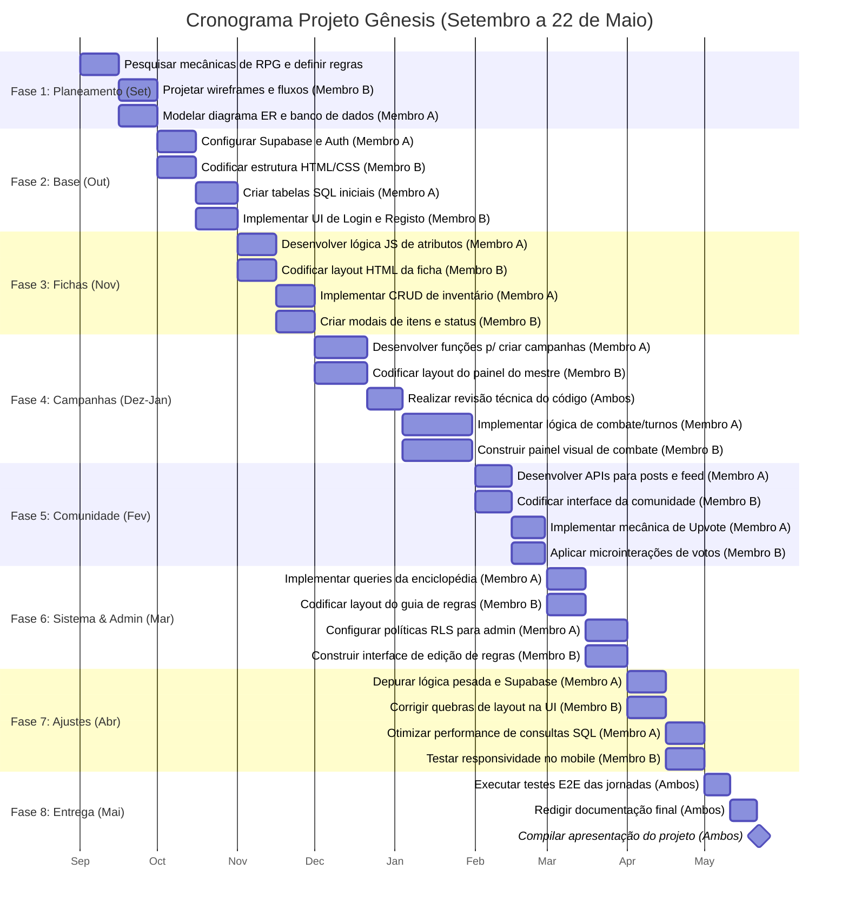

# 📅 Cronograma de Desenvolvimento - Projeto Gênesis (RPG)

Este documento detalha o planeamento do projeto (de setembro até 22 de maio), distribuído de forma justa e equilibrada para uma equipa de duas pessoas. Ninguém fica sobrecarregado ou sem trabalho em nenhum momento.

**Equipa:**
*   **Membro A (Foco Backend/Lógica):** Banco de dados (Supabase), SQL, autenticação, lógica pesada em JavaScript (turnos, cálculos).
*   **Membro B (Foco Frontend/UI):** HTML/CSS (UI/UX responsiva), integrações DOM, design de componentes, interações visuais.

---

## 📊 Gráfico Gantt (Visão Geral)

---

## 📋 Divisão Detalhada de Tarefas (Equilibrada e Acionável)

### 📌 1. Setembro: Planeamento e Arquitetura
*   **Ambos:** **Pesquisar mecânicas de RPG e definir regras base** para sistema de combate, cálculos de atributos e magias.
*   **Membro A:** **Modelar o diagrama ER e arquitetura do banco de dados**, definindo chaves estrangeiras e relações do Supabase.
*   **Membro B:** **Projetar wireframes e fluxos de navegação (Figma)** de todas as telas principais (Fichas, Combate, Comunidade).

### 📌 2. Outubro: Base do Projeto
*   **Membro A:** **Configurar Supabase e implementar sistema de autenticação** utilizando a API de Auth (Login e Registo).
*   **Membro B:** **Codificar estrutura base HTML/CSS e variáveis globais**, estabelecendo o design system (cores, tipografia).
*   **Membro A:** **Criar tabelas SQL iniciais para utilizadores e perfis** no Supabase.
*   **Membro B:** **Implementar a interface (UI) das telas de Login e Registo** com validação de formulários frontend.

### 📌 3. Novembro: Fichas de Personagem
*   **Membro A:** **Desenvolver lógica JS para cálculo de atributos na ficha** (Vida, Mana, Iniciativa, Bónus de força/agilidade).
*   **Membro B:** **Codificar o layout HTML/CSS da ficha de personagem**, estilizando inputs, labels e barras de progresso.
*   **Membro A:** **Implementar CRUD e gestão de inventário no backend**, salvando itens e armas na base de dados (Supabase JSON/Tabelas).
*   **Membro B:** **Criar modais de interface para adicionar itens e técnicas** (Magias/Habilidades), com janelas sobrepostas e botões de fechar.

### 📌 4. Dezembro: Início das Campanhas
*   **Membro A:** **Desenvolver funções SQL e JS para criação de campanhas**, incluindo vincular utilizadores a uma campanha específica.
*   **Membro B:** **Codificar layout do painel do mestre e lista de campanhas** no frontend, criando os cartões que listam campanhas ativas.
*   **Ambos:** **Realizar revisão técnica do código (Pausa de Férias)** e reavaliar o cronograma.

### 📌 5. Janeiro: Sistema de Combate e Turnos (Foco Máximo)
*   **Membro A:** **Implementar lógica de combate e gestão de turnos em tempo real**, utilizando *realtime subscriptions* do Supabase para refletir o turno atual.
*   **Membro B:** **Construir painel visual de combate com animações de dados**, desenvolvendo a área onde os ícones de personagem aparecem na linha do tempo.

### 📌 6. Fevereiro: Comunidade
*   **Membro A:** **Desenvolver APIs e SQL para criação de posts e feed**, recuperando os posts mais recentes da comunidade com paginação.
*   **Membro B:** **Codificar interface da comunidade e sistema de comentários** criando uma UI no formato *feed*, com campos de input intuitivos.
*   **Membro A:** **Implementar mecânica de Upvote/Downvote e algoritmos de filtro** (Ex: Mais Votados, Recentes) utilizando SQL complexo.
*   **Membro B:** **Aplicar feedback visual e microinterações no sistema de votos**, alterando a cor e estado dos botões ao serem clicados.

### 📌 7. Março: Painel Admin & Enciclopédia (Sistema)
*   **Membro A:** **Implementar querys SQL para extrair capítulos da enciclopédia** a partir da tabela `capitulos_sistema`.
*   **Membro B:** **Codificar layout responsivo do guia de regras do sistema** no frontend, organizando em menus laterais tipo Wiki.
*   **Membro A:** **Configurar políticas RLS e proteção de rotas para admin**, impedindo utilizadores normais de apagarem publicações de outros.
*   **Membro B:** **Construir interface de edição de regras no painel admin**, substituindo popups padrão do navegador por modais customizados.

### 📌 8. Abril: Fase de Polimento (Bugfixing)
*   **Membro A:** **Depurar lógica pesada e corrigir bugs no backend/Supabase** (Ex: falhas no realtime do combate, cálculo de HP).
*   **Membro B:** **Corrigir quebras de layout e alinhar elementos visuais** inconsistentes em diferentes navegadores.
*   **Membro A:** **Otimizar performance de consultas e rever segurança SQL**, garantindo que não haja acessos indevidos aos dados.
*   **Membro B:** **Testar responsividade e corrigir bugs no mobile**, garantindo que as fichas e o combate são usáveis num telemóvel.

### 📌 9. Maio (1 a 22): Testes, Relatório e Entrega
*   **Ambos:** **Executar testes E2E cobrindo todas as jornadas do utilizador**, como se fossem mestre e jogador a usar a plataforma.
*   **Ambos:** **Redigir capítulos técnicos e elaborar manuais do relatório** para a documentação escrita exigida na PAP.
*   **Ambos:** **Compilar versão final e preparar a apresentação do projeto**, ensaiando o discurso até o dia 22 de maio.
