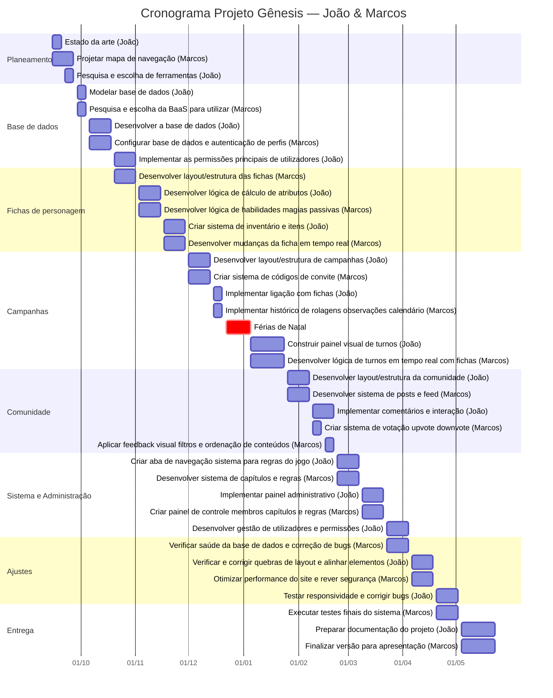

# 📅 Cronograma - Projeto Gênesis (RPG)

**Período:** 15 Set 2025 → 22 Mai 2026 | **Equipa:** João & Marcos — **18 tasks cada**
> 🎄 Férias de Natal: **22 Dez 2025 – 4 Jan 2026** (ambos em pausa)

---

## 📊 Gantt

---

## 📋 Períodos de Trabalho

| Período | João | Marcos |
|---------|------|--------|
| Set 15–19 | Estado da arte | Projetar mapa de navegação |
| Set 22–26 | Pesquisa e escolha de ferramentas | Projetar mapa de navegação |
| Set 29–Out 3 | Modelar base de dados | Pesquisa e escolha da BaaS para utilizar |
| Out 6–17 | Desenvolver a base de dados | Configurar base de dados e autenticação de perfis |
| Out 20–31 | Implementar as permissões principais de utilizadores para a base de dados | Desenvolver layout/estrutura das fichas |
| Nov 3–14 | Desenvolver lógica de cálculo de atributos | Desenvolver lógica de habilidades, magias, passivas |
| Nov 17–28 | Criar sistema de inventário e itens | Desenvolver mudanças da ficha em tempo real |
| Dez 1–12 | Desenvolver layout/estrutura de campanhas | Criar sistema de códigos de convite |
| Dez 15–19 | Implementar ligação com fichas | Implementar histórico de rolagens (dados), observações, calendário |
| 🎄 Dez 22–Jan 4 | **FÉRIAS DE NATAL** | **FÉRIAS DE NATAL** |
| Jan 5–23 | Construir painel visual de turnos | Desenvolver lógica de turnos em tempo real ligado com as fichas |
| Jan 26–Fev 6 | Desenvolver layout/estrutura da comunidade | Desenvolver sistema de posts e feed |
| Fev 9–13 | Implementar comentários e interação | Criar sistema de votação (upvote, downvote) |
| Fev 16–20 | Implementar comentários e interação | Aplicar feedback visual, filtros e ordenação de conteúdos |
| Fev 23–Mar 6 | Criar aba de navegação "sistema" para regras do jogo | Desenvolver sistema de capítulos e regras |
| Mar 9–20 | Implementar painel administrativo | Criar um painel de controle membros, capítulos e regras |
| Mar 23–Abr 3 | Desenvolver gestão de utilizadores e permissões | Verificar "saúde" da base de dados e correção de bugs |
| Abr 6–17 | Verificar e corrigir eventuais quebras de layout e alinhar elementos visuais | Otimizar performance do site e rever segurança |
| Abr 20–Mai 1 | Testar responsividade e corrigir bugs | Executar testes finais do sistema |
| Mai 4–22 | Preparar documentação do projeto | Finalizar versão para apresentação |

---

## 🧮 Resumo

| | João | Marcos |
|-|:----:|:------:|
| **Tasks** | **18** | **18** |
| **Férias Natal** | Dez 22 – Jan 4 | Dez 22 – Jan 4 |
| **Entrega final** | 22 Mai 2026 | 22 Mai 2026 |
